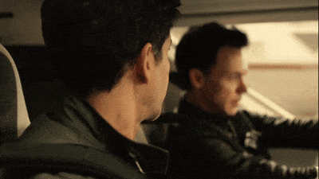
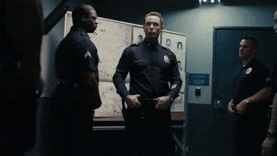

# OpenHumanVid
This is the offical Github repository of OpenHumanVid.

**[OpenHumanVid: A Large-Scale High-Quality Dataset for Enhancing Human-Centric Video Generation](https://fudan-generative-vision.github.io/OpenHumanVid/#/)**
</br>
[Hui Li*](https://github.com/crystallee-ai),
[Mingwang Xu*](https://github.com/xumingw),
[Yun Zhan](https://github.com/subazinga),
[Shan Mu](https://github.com/AricGamma),
[Jiaye Li](https://github.com/Studentxll),
[Kaihui Cheng](https://github.com/Kaihui-Cheng),
[Yuxuan Chen](https://github.com/Shr1ke777),
[Tan Chen](https://github.com/tchen0623),
[Mao Ye](#),
[Jingdong Wang](https://jingdongwang2017.github.io/),
[Siyu Zhu](https://sites.google.com/site/zhusiyucs/home),
</br>

[](https://arxiv.org/abs/2412.00115)
[](https://fudan-generative-vision.github.io/OpenHumanVid/#/)

## Introduction
OpenHumanVid is a large-scale and high-quality human-centric video dataset characterized by precise and detailed captions that encompass both human appearance and motion states, along with supplementary human motion conditions, including skeleton sequences and speech audio.

## Demonstration
### Video-Caption Pairs in OpenHumanVid

<table class="center">
  <!-- Row 1 -->
  <tr>
    <td width=25% style="border: none"></td>
    <td width=25% style="border: none"></td>
    <td width=25% style="border: none"></td>
    <td width=25% style="border: none"></td>
  </tr>
  <tr style="text-align: center;">
    <td width=25% style="border: none">A man in a dark suit and blue plaid shirt stands in a room with classical architecture, speaking earnestly to the camera with a serious expression.</td>
    <td width=25% style="border: none">A woman in a white hoodie with red hearts and a space-themed t-shirt interacts with a vending machine in a cafeteria, her expression shifting from surprise to frustration.</td>
    <td width=25% style="border: none">A man in a dark suit descends a modern staircase, engaged in a phone conversation, showing concern, in a contemporary indoor environment with signs and a security camera.</td>
    <td width=25% style="border: none">A middle-aged man with glasses stands outside a residential building, wearing a gray polo shirt, then suddenly changes to a dark gray polo shirt, with a concerned expression.</td>
  </tr>

  <!-- Row 2 -->
  <tr>
    <td width=25% style="border: none"></td>
    <td width=25% style="border: none"></td>
    <td width=25% style="border: none"></td>
    <td width=25% style="border: none"></td>
  </tr>
  <tr style="text-align: center;">
    <td width=25% style="border: none">A woman in a white lab coat and green vest stands in a modern office, holding a glass door handle, then walks past a bookshelf and a 'NO EXIT' glass door.</td>
    <td width=25% style="border: none">A woman in her thirties with short, dark hair, wearing a blue blouse, holds a glass in a relaxed, attentive manner in a neutral-colored indoor setting, possibly a home, under soft, natural lighting.</td>
    <td width=25% style="border: none">A woman with a beaming smile and large round glasses walks down a professional hallway.</td>
    <td width=25% style="border: none">A man with long, dark hair and a beard stands by a serene lake, dressed in a regal red garment with gold accents, holding a golden staff.</td>
  </tr>

  <!-- Row 3 -->
  <tr>
    <td width=25% style="border: none"></td>
    <td width=25% style="border: none"></td>
    <td width=25% style="border: none"></td>
    <td width=25% style="border: none"></td>
  </tr>
  <tr style="text-align: center;">
    <td width=25% style="border: none">Two men, one in a dark jacket and the other in a dark leather jacket, sit in a vehicle, the driver focused on the road, the passenger looking at him intently.</td>
    <td width=25% style="border: none">A relaxed male in a dark poncho and hat, and a female in vibrant traditional attire, engage in a casual conversation in a serene outdoor setting surrounded by rustic structures.</td>
    <td width=25% style="border: none">Two young girls, one in a white lace dress and the other in light green, sit contemplatively and playfully on a wooden bunk bed in a dimly lit, vintage-style room.</td>
    <td width=25% style="border: none">Two men, one in a dark suit and the other in casual attire, interact with a third man in a dark suit in varying settings with serious expressions.</td>
  </tr>

  <!-- Row 4 -->
  <tr>
    <td width=25% style="border: none"></td>
    <td width=25% style="border: none"></td>
    <td width=25% style="border: none"></td>
    <td width=25% style="border: none"></td>
  </tr>
  <tr style="text-align: center;">
    <td width=25% style="border: none">A middle-aged individual in a traditional gray garment stands near a window, extending their hand in a contemplative pose, in a calm and serene domestic setting.</td>
    <td width=25% style="border: none">A woman in her thirties or forties, wearing a floral green dress, and a man in his twenties, in a blue button-up shirt, engage in a casual conversation in a dimly lit kitchen.</td>
    <td width=25% style="border: none">Three officers stand in a dimly lit police station briefing area, their serious expressions reflecting the situation, with a central officer flanked by two colleagues amidst a map and door.</td>
    <td width=25% style="border: none">A young individual, likely in their late teens or early twenties, sits in a well-lit space, surrounded by sports memorabilia, intently playing with a basketball.</td>
  </tr>
</table>


## Dataset

### Collection Pipeline
<p align="center" width="100%">
<a target="_blank"></a>
</p>
We preprocess raw videos through decoding, cropping, and segmentation, followed by quality filtering based on luminance, blur, aesthetics, motion, and technical metrics. Human skeleton data and speech audio are extracted, and structured captions are generated using MiniCPM, CogVLM, and Llama, refined by BLIP2 voting. Advanced quality filtering ensures captions align with visual details like appearance, expressions, and poses for fine-grained accuracy.

### Download
| Download  | # Samples | Video Duration | Storage Space|
|----------|-----------|----------------|--------------|
| [link](https://forms.gle/moqec5Qod7mz9pfD6) | 13.2M | 16.7 khrs  | ~6.05 TB  |


## License of OpenHumanVid
The video samples are collected from the publicly available dataset. Users must follow [the license](https://github.com/fudan-generative-vision/OpenHumanVid/blob/main/LICENSE) to use these video samples.  
To prevent the misuse of OpenHumanVid dataset, we require your information to be submitted for review and approval prior to granting access for download. [Fill out the form](https://forms.gle/moqec5Qod7mz9pfD6).

## Citation

If you find this project useful for your research, please cite our paper. :blush:

```bibtex
@article{li2024openhumanvid,
  title={OpenHumanVid: A Large-Scale High-Quality Dataset for Enhancing Human-Centric Video Generation},
  author={Li, Hui and Xu, Mingwang and Zhan, Yun and Mu, Shan and Li, Jiaye and Cheng, Kaihui and Chen, Yuxuan and Chen, Tan and Ye, Mao and Wang, Jingdong and others},
  journal={arXiv preprint arXiv:2412.00115},
  year={2024}
}
```

